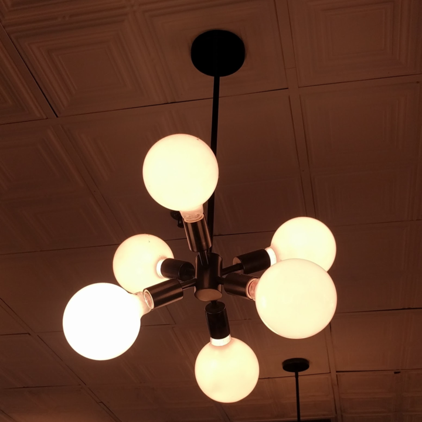
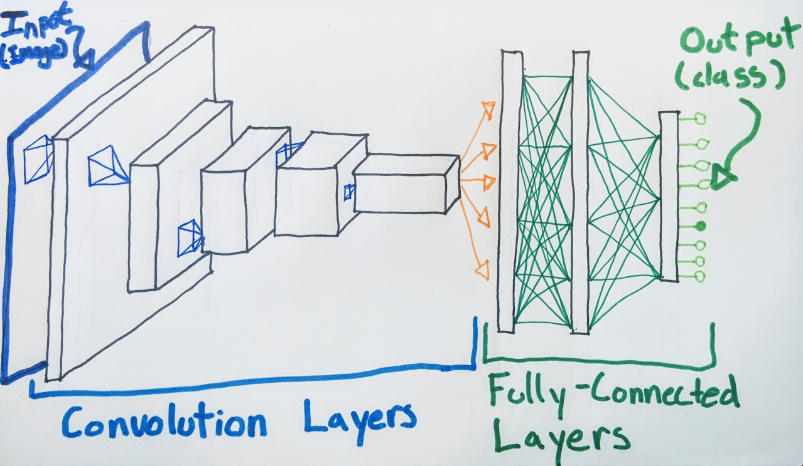
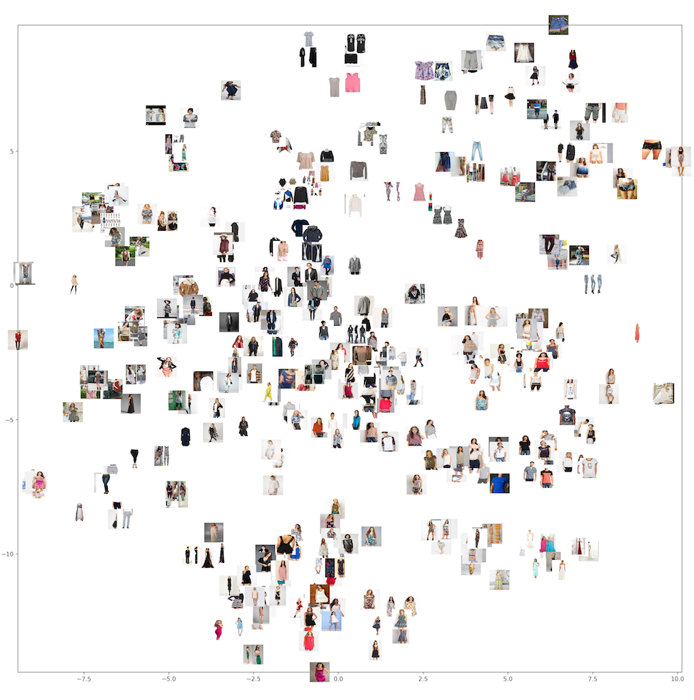
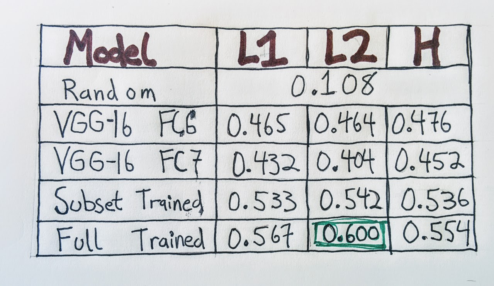
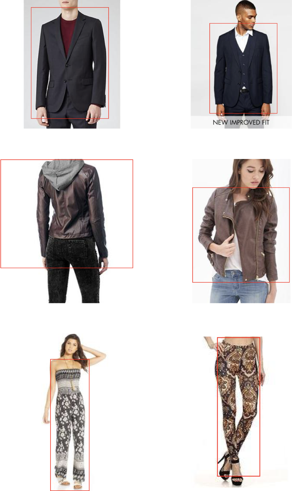

# Building a Visual Search Algorithm

This story, like all great stories, begins with a light fixture. In particular, this light fixture:



Datascope intern, Chris, spotted this light fixture while out at lunch one day and was immediately transfixed by its glowing, orthogonal orbiness. In an attempt to find where he could buy his own wonderful light fixture, he took a picture with his camera and used [Google Reverse Image Search](https://images.google.com/) to find places that might have the product online. However, while Google was able to show him lots of pictures of light fixtures, it wasn't able to show him the exact product he was looking for. This is partially because Google Reverse Image Search is designed to find similar **pictures** and not similar **items**.

This lead us to consider what a visual **item** search might look like and how we might build one. Leveraging some articles on [style transfer](http://ruder.io/transfer-learning/) and [auto-encoders](https://en.wikipedia.org/wiki/Autoencoder) we sort-of remembered, we started to think about ways that machine learning could perform this search.

Some quick googling revealed that we weren't the first people to have this idea. Back in March of this year, [Pinterest released a beta version of a visual search application called Lens](https://blog.pinterest.com/en/and-you-get-lens-and-you-get-lens-and-you-get-lens). In June, [Wayfair introduced a visual search feature to their app and website](http://engineering.wayfair.com/2017/06/visual-search-with-deep-learning/). A few days after Chris found the light fixture of his dreams, Amazon announced a "product social discovery network" that's basically [Instagram with links directly from photos to Prime pages](https://arstechnica.com/business/2017/07/amazon-spark-is-a-product-discovery-social-network-that-looks-like-instagram/)

While this effectively crushed our dreams of becoming Silicon Valley billionaires, it gave us confidence that visual search was achievable using existing technologies. Because we were so excited about this idea, we decided to see how much progress we could make in building a visual search engine using publicly available data and open-source code.

## So, What is this Visual Search Thing Anyway?

To build a visual search engine, we need a model that works on images. One of the challenges in dealing with images is high dimensionality. Even a relatively low-resolution 640x480 photograph contains nearly one million data points, making it difficult to use as a direct input to machine learning classifiers. Fortunately, a particular type of neural network that tends to excel at working with and learning from these images is the Convolutional Neural Network, because it is good at encoding local relationships between pixel values in nearby areas of the image. I'll leave [a more detailed explanation](https://ujjwalkarn.me/2016/08/11/intuitive-explanation-convnets/) of Convolutional Neural Networks (CNNs) to someone [smarter than me](http://cs231n.github.io/convolutional-networks/). But, to briefly summarize, CNNs use a collection of convolutional filters and pooling layers to drastically reduce the dimensionality of images while still retaining the salient features. In fact, the most successful CNNs use several convolution and pooling layers to create so-called Deep Networks that are extremely successful at visual recognition tasks.

These CNNs have a large number of hyperparameters and typically require large datasets and a lot of training in order to reach very high accuracy in visual classification. Fortunately for us, many programmers and computer vision researchers have decided to open-source not only deep-learning software libraries but also the results of pre-trained models. This allows us to start with state-of-the-art models created by dedicated research teams and then slightly modify them to to fit our own particular problem.

## Building the Search Engine

While our interest in product search started with a light fixture, we ended up training our model on images of clothing from the [Deep Fashion data set](http://mmlab.ie.cuhk.edu.hk/projects/DeepFashion.html). The reason that we chose this data set is because it contains a large number of images that are annotated with category and attribute labels and provides bounding box information for the labels. This bounding box information is very helpful in creating a training set, because it allows us to separate the product from the rest of the image, which is a necessary pre-processing step. [ref]We could probably automatically create bounding boxes using a network trained in [Object Localization](https://leonardoaraujosantos.gitbooks.io/artificial-inteligence/content/object_localization_and_detection.html), but that's a topic for another blog post.[/ref] The Deep Fashion data set has the advantage of providing us with examples of products in a wide variety of shapes, sizes, colors, patterns, textures, etc. Learning to train a model on the Deep Fashion data set will give us insight on how to extend this method to other items.

With the data set selected, we need to actually build our visual product search algorithm. Lucky for us, the engineering team behind Pinterest's visual search product published [a research paper outlining their approach](https://arxiv.org/pdf/1702.04680.pdf). We can use the results of their work as a blueprint for creating our own visual search.

The core concept behind this method of visual search relies on using the intermediate results of a pre-trained CNN as a feature vector and finding products with features that are nearby to the input vector. The logic behind this is that a CNN trained at visual classification typically has two sections: a series of convolutional layers trained at extracting meaningful visual information from the input image and a series of dense layers trained at performing the classification task. Using the output of the convolutional layers to represent images allows us to perform comparisons in a vector space that corresponds to visual attributes as opposed to semantic attributes (i.e. the predicted image category). Instead of answering the question "Is this a chair?", we can answer the question, "Does this image have similar color/pattern/shading as another image?"



For this task, we decided to use the [VGG-16](http://www.robots.ox.ac.uk/~vgg/research/very_deep/) network because of its strong performance at visual classification without having to use networks with more complicated structures such as [Inception](https://github.com/google/inception) or [ResNet](https://github.com/KaimingHe/deep-residual-networks)


Getting started with this task is almost comically easy thanks to the high-level neural network library [Keras](https://keras.io/). We can directly import the VGG-16 architecture and download the weights from a pre-trained model in one simple step.

```python
from keras.applications import VGG16

model = VGG16(weights='imagenet')
```

Then, we can create a model that gives us just the output of the first fully connected layer and start producing feature vectors

```python
from keras.applications import imagenet_utils
from keras.preprocessing.image import img_to_array
from keras.preprocessing.image import load_img
from keras.models import Model


feature_model = Model(inputs=model.input,outputs=model.get_layer('fc1').output)

inputShape = (224, 224)
preprocess = imagenet_utils.preprocess_input

file = 'path/to/image/file.jpg'
image = load_img(file,target_size=inputShape)
image = img_to_array(image)
image = np.expand_dims(image,axis=0)
image = preprocess(image)
    
feature = feature_model.predict(image)
```

Using the pre-trained weights from VGG-16 gives us pretty good results, but these weights come fromthe [ImageNet challenge](http://www.image-net.org/challenges/LSVRC/), which involves classifying images into 1,000 categories ranging from fire truck to airplane to one of 120 different breeds of dog. ([seriously](https://arxiv.org/pdf/1409.0575.pdf)) However, for our task, we want to look at small differences between pieces of clothing. To VGG-16, all 80,000 images of a dress might look the same since they fall in the same category, so we need to train our network to learn more subtle differences.

Fortunately, we can re-train our network on the DeepFashion data set while still leveraging the power of pre-trained networks through a technique known as [transfer learning](http://cs231n.github.io/transfer-learning/). This means that we take a pre-trained network like VGG-16 and re-use the weights in the convolutional layers, but learn completely new weights (and architectures) for the dense classification layers at the end. Again, Keras makes this process very simple for us:

```python
from keras.layers import Dense

base_model = VGG16(weights='imagenet', include_top=False, input_shape=(224, 224, 3))
x = base_model.output

x = Dense(4096, activation='relu', name='fc1')(x)

predictions = Dense(len(classes), activation='softmax',name='predictions')(x)

new_model = Model(inputs=base_model.input, outputs=predictions)

for layer in base_model.layers:
    layer.trainable = False

new_model.compile(optimizer='Adadelta', loss='sparse_categorical_crossentropy',
                 metrics = ['sparse_categorical_accuracy'])
```

Here, we have removed the top layers of the VGG-16 network and replaced them with a 4,096-node dense hidden layer and softmax activated output layer, which gives predictions for which of the 50 Deep Fashion categories the image belongs to. We are going to use the output of this dense (or fully connected) hidden layer as the feature vector in our product search. 

Now that we have our model set up, we just have to train it. Using a cloud computing service like AWS allows us to save both time and money by giving us access to machines with strong GPU computing capabilities and preconfigured deep learning software. For this project, we used a p2.xlarge instance which gives us a GPU with 12GB of dedicated RAM for only 90 cents an hour. [With discount prices like these](https://www.youtube.com/watch?v=hJ9yBgTp9UQ) we can't afford to *not* train this network. After a few hours, the loss started to converge, so we stopped training. Training a neural network is a whole artform unto itself, but since we were just exploring the idea, we didn't want to spend too much time on this step before moving on to ttesting. 

## Creating a Map of the Fashion World

The idea behind our product search method is that our CNN takes in an image of a product and puts out a set of coordinates where similar products have nearby coordinates. To see how this idea held up, we wanted to visualize where different products wound up in the coordinate space created by our CNN. However, the coordinates created from our CNN are 4,096-dimensional, which means my monitor is 4,094 dimensions short of being able to properly recreate this space.  Instead, we used a popular dimensionality-reduction technique known as [t-SNE](https://en.wikipedia.org/wiki/T-distributed_stochastic_neighbor_embedding) to create a 2-dimensional representation of our full feature space. Taking a few hundred sample images and plotting them in this 2D map gives us a quick check of how well our feature space organizes similar items. We see that similar items do cluster together as similar products land nearby each other.



## Testing Different Models

While t-SNE is an interesting visualization, it doesn’t tell us how well the model performs at the product search task. During development, we ended up with a few different models for visual search we wanted to test: the two different fully connected hidden layers from the pre-trained VGG-16 network (we'll call them FC6 and FC7); the fully connected layer from our re-trained model; and the fully connected layer from yet another model trained on a subset of the fashion images only featuring the 22 most common DeepFashion categories. In addition to these separate models, we also had to decide on a metric to to measure the distance between feature vectors. For our testing, we limited ourselves to the [L1 (or taxicab) distance](https://en.wikipedia.org/wiki/Taxicab_geometry), the [L2 (or Euclidean) distance](https://en.wikipedia.org/wiki/Euclidean_distance) and the [Hamming distance](https://en.wikipedia.org/wiki/Hamming_distance) applied to feature vectors that have been turned into 4,096-bit binary strings based on whether or not their value was positive in each dimension. There are certainly more sophisticated metrics we could have employed, but we started out with the simplest choice to see how well they worked.

In evaluating the results of our different models, we aimed to consistently judge the rather subjective question of "do these two things match?" Starting with four different models and three distance metrics, we needed a quick way to identify the most promising models. To do so, we started with a randomly sampled subset of 20,000 images and generated their feature vectors with each of the models. Then, we selected 1,000 images from that set and found their nearest neighbor using each of the three metrics. We evaluated accuracy by testing whether the nearest match belonged to the same category as the source image. For example, if we randomly selected an image of a romper, then we would count the matching algorithm as being accurate if the suggested match is also a romper.



First, we performed a control test and see that randomly selecting pairs from the subset gives us 10.8% accuracy (this is due to the highly imbalanced nature of the category distribution). The off-the-shelf pre-trained VGG-16 network already beat that benchmark, but the re-trained networks gave us an even greater boost in performance, with the network trained on the full set of categories giving us up to 60% accuracy in matching items on this subset. 


*Three examples of product matches generated with our product matching scheme with the bounding box oulined in red. On the left is a randomly selected image and the closest product as determined by our algorithm on the right.*

While this lets us quickly evaluate the performance of our models using the existing image labels, it's not the best way to judge whether or not two items look the same. The category labels we have are relatively coarse-grained; we know if the network can distinguish between a coat and pants, but can it tell the difference between flannel and gingham? Since we are working on solving a task that is inherently subjective, we decided the best way to actually evaluate it was to get human feedback rating its performance.

## The Human Side of Deep Learning

Having our CNNs do a bunch of math to find pairs of neighboring images is all well and good for machine learning contests, but it doesn’t necessarily tell us how well our models work *for people.* In this case, which of our variations on visual search does the best job at helping people find similar items?

When finding matching clothes, “similarity” means different things to different people for different reasons. Faced with a subjective problem like this, one way to evaluate which of our models provides[the greatest amount of good to the greatest number of people](https://plato.stanford.edu/entries/utilitarianism-history/) is to put them head-to-head in a blind test. To get a better sense of how our visual search algorithms work from a human-centered perspective, we built a little website that lets our users vote and decide for us!

If you head on over to [Dope or Nope? by Datascope](https://dopeornope.datascopeanalytics.com) and click on “Play Dope or Nope,” you can participate too! You’ll cycle through random pairs of items that one of seven visual search networks determined to be “nearest neighbors.” If you like the match, swipe right. Otherwise, swipe left. Simple and fun, no? Setting up little games like this is a good way to get quick feedback from the people that matter the most: your users.

Speaking of feedback, we also built in a leaderboard to see how the models stack up against each other. A bunch of Datascopers have voted over the past few days, and here’s how things stand as of press time

TKTK Screencap Leaderboard after Datascopers have voted on 

Some thoughts on the results so far: most of the models have a similar performance, hovering somewhere in the 40-45% approval rating, with one model standing above the pack with a ~64% approval rating. This is a model that was retrained on the deep fashion set, uses the FC6 layer features and finds the nearest neighbors using the Hamming distance. This result is consistent with the findings of the Pinterest paper we based our model on. However, it is hard to know ahead of time which particular combination of features will perform best on your problem, and I think this is a good example of why you should try lots of models and iterate quickly. Moreover, this is only what *we’ve* seen so far, and we’re excited for you to be part of the process. [Are our networks totally dope? Or do they just make you want to say “...nope?”](https://dopeornope.datascopeanalytics.com) 

## What we Learned from Machines/How to Repay the Favor

We wanted to see how difficult it was to build a visual search engine using little more than open-source code, public data, and our own gumption. After a few weeks of hacking, we’re happy to report that many of the requisite steps are actually quite easy. Thanks to libraries like Keras, it was no problem for us to stand on the shoulders of giants and use state-of-the-art networks as a starting point for our work. Retraining these networks to learn specifically about fashion products (instead of the thousands of objects employed in the Imagenet database) was slightly more time and cost intensive, but thanks to the kind souls at AWS, not prohibitively so.

On the other hand, this exploration exposed us to challenges that any aspiring computer vision application would need to overcome. We were lucky to have a data set that had such rich annotations *and* was relatively uniform in scope and style. Anyone building a product search application from “images in the wild” would likely spend a good deal of time extracting the products that live inside those images (perhaps even training entirely separate networks to do so) and dealing with the wide varieties of angles, background lighting, resolutions, and overall quality of those “wild images.” Sure, there are techniques to account for these variations, but deciding which methods to use isn’t something you get for free. The uniformity of data we worked with was both a blessing and a curse: it made our lives easier, but also imbued our models with bias. If we were building out an actual application, it would need to generalize beyond a database of curated fashion images and work with photos snapped on a phone.

The diversity of images a visual search application would need to handle is matched only by diversity of user preferences it needs to account for. At the end of the day, no standard metric reveals whether your algorithm is doing well by your users: only your users can tell you that. Particularly if you’re geeks like us, it’s sometimes easy to get buried in the computational nuts and bolts of a problem. But because we care primarily about solving problems for people, we’re not shy about getting the results of our tinkering out in front of people as quickly as possible. People like you contributing to little experiments like Dope or Nope will tell us more about what’s working well (or not well) and how we can improve than any array of GPU machines can.  In that regard, machines have about as much to learn from us as we have to learn from them. Working carefully, mindfully, and iteratively, we can ride the sometimes bumpy road toward that global optimum off in the sunset.


